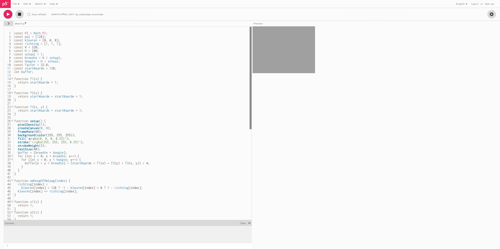

# Plasma
Plasma met behulp van p5.js

-----

*English*

Hello! Today we are going to work on the project *Plasma* using p5.js.

p5.js is a free and open-source JavaScript library.

We will start from an existing code in p5.js editor and modify it accordingly to get to the final result.

Each assignment contains explanations, and things that you have to do yourself. The things that you have to do yourself are indicated with `▶▶▶`.

At first you have a design that changes between light and dark Grey, and your job is to make it multi-colored:

When you are completely finished, the end result will look like this:

### Assignment 0: Open p5js editor

The programming environment we'll be working in is called *[p5js](https://p5js.org/)*. 

▶▶▶ Open the project by clicking on the link: [https://editor.p5js.org/coderdojo-enschede/sketches/RhEVMuwXV](https://editor.p5js.org/coderdojo-enschede/sketches/RhEVMuwXV)

There are several things to see:
- Run button (upper left side - triangle) - *Play sketch*
- Stop button (upper left side - square) - *Stop sketch*
- Code (left side)
- The result (right side)

In the following assignments, we'll modify the code, run it, and view the result on the right side.

That was easy! Now comes the real work!

### Assignment 1: Colors

So far everything is Grey, but we can change that. 

▶▶▶ Look on the left side. It says 'Assignment 1'.

Using *const* we have defined a few variables, which help us in creating the design.

If you look carefully, there are two important variables: *kleuren* and *richting*.

They define the colors used and the way they change over time.

▶▶▶ Change the values of *kleuren* from [0, 0, 0] to [42, 84, 126].

▶▶▶ Change the values of *richting* from [1, 1, 1] to [1, 1, -1].

▶▶▶ Click the run button to see the new changes!

### Assignment 2: Functions f1->3

Functions are like magic boxes. You can give a function two numbers, and it will give you their sum.

Now let's look at some of the functions for this project.

▶▶▶ Look on the left side. It says 'Assignment 2'.

▶▶▶ Look at the function with the name *f1*

Found it? Great!

▶▶▶ Let's change the code inside from `return startWaarde * 1;` to `return startWaarde * sin(x / factor);`

▶▶▶ Next we'll look at the function with the name *f2*

Found it? Amazing!

▶▶▶ Now let's change from `return startWaarde + startWaarde * 1;` to `return startWaarde + startWaarde * cos(y / factor);`

▶▶▶ The last function on this assignment is the one called *f3*

Found it? Perfect!

▶▶▶ We'll change the code inside from `return startWaarde + startWaarde * 1;` to `return startWaarde + startWaarde * sin(sqrt(x * x + y * y) / factor);`

▶▶▶ Click the run button to see the new changes!

Nothing seems to have changed, right? Let's take a look at the next assignment...

### Assignment 3: Functions s1->3

▶▶▶ Scroll down on the left side. It says 'Assignment 3'.

We have 3 functions called s1, s2 and s3, which all do the same thing: `return 1`. 

We will modify the code for all 3 functions.

▶▶▶ First look at the function with the name *s1*

▶▶▶ Let's change the code from `return 1;` to `return sin((i * PI) / 25 + PI / 2);`

▶▶▶ Next we'll look at the function with the name *s2*

▶▶▶ We'll change the code from `return 1;` to `return sin((i * PI) / 50 + PI / 4);`

▶▶▶ Lastly we'll look at the function with the name *s3*

▶▶▶ We'll change the code from `return 1;` to `return sin(((64 - i) * PI) / -50 + PI / 8);`

▶▶▶ Now click the run button to see the new changes!

### Assignment 4: Text position

We have a text that is not visible yet. We have to change that.

▶▶▶ Look on the left side. It says 'Assignment 4'.

▶▶▶ Change `let textX=-50;` to `let textX=50;`

▶▶▶ Change `let textY=-100;` to `let textY=100;`

▶▶▶ Now click the run button to see the new changes!

### Assignment 5: CoderDojo icon

The last step is to add an icon to the text!

▶▶▶ Look on the left side. It says 'Assignment 5'.

▶▶▶ Change `text('CoderDojo', textX+sin(textI/60)*50, textY+cos(textI/60)*25);` to `text('☯️CoderDojo', textX+sin(textI/60)*50, textY+cos(textI/60)*25);`

The only difference between them is the ☯️ icon.

▶▶▶ Now click the run button to see the new changes!

It is done! Good job!

-----

*Dutch*

Hallo! Vandaag gaan we het spel *Plasma* maken.

p5.js is een gratis en open-source JavaScript-bibliotheek.

.....

Elke opdracht bevat uitleg, en dingen die jij zelf moet doen. De dingen die jij zelf moet doen, staan aangegeven met `▶▶▶`.

....

Als je helemaal klaar bent, zal het eindresultaat er ongeveer zo uit zien:

### Opdracht 0: Open p5js editor

De programmeeromgeving waarin we gaan werken heet *[p5js](https://p5js.org/)*. 

▶▶▶ Open p5.js door op de link te klikken: [https://editor.p5js.org/coderdojo-enschede/sketches/RhEVMuwXV](https://editor.p5js.org/coderdojo-enschede/sketches/RhEVMuwXV)

Er zijn meerdere dingen te zien:
- .....
- .....
- Code (links)
- Het resultaat (rechterkant)

.....

Dat was gemakkelijk! Nu komt het echte werk!

### Opdracht 1: Colors

.....

▶▶▶ Ga naar links. Er staat 'Opdracht 1'.

.....

.....

.....

▶▶▶ Verander `const kleuren = [0, 0, 0];` naar `const kleuren = [42, 84, 126];`

▶▶▶ Verander `const richting = [1, 1, 1];` naar `const richting = [1, 1, -1];`

▶▶▶ .....

### Opdracht 2: Functions f1->3

.....

.....

▶▶▶ Ga naar links. Er staat 'Opdracht 2'.

▶▶▶ Ga naar de functie *f1*.

Heb je het gevonden? Goed!

▶▶▶ Verander `return startWaarde * 1;` naar `return startWaarde * sin(x / factor);`

▶▶▶ Ga naar de functie *f2*

Heb je het gevonden? Geweldig!

▶▶▶ Verander `return startWaarde + startWaarde * 1;` naar `return startWaarde + startWaarde * cos(y / factor);`

▶▶▶ Ga naar de functie *f3*.

Heb je het gevonden? Perfect!

▶▶▶ Verander `return startWaarde + startWaarde * 1;` naar `return startWaarde + startWaarde * sin(sqrt(x * x + y * y) / factor);`

▶▶▶ .....

.....

### Opdracht 3: Functions s1->3

▶▶▶ Ga naar links. Er staat 'Opdracht 3'.

.....

.....

▶▶▶ Ga naar de functie *s1*.

▶▶▶ Verander `return 1;` naar `return sin((i * PI) / 25 + PI / 2);`

▶▶▶ Ga naar de functie *s2*.

▶▶▶ Verander `return 1;` naar `return sin((i * PI) / 50 + PI / 4);`

▶▶▶ Ga naar de functie *s3*.

▶▶▶ Verander `return 1;` naar `return sin(((64 - i) * PI) / -50 + PI / 8);`

▶▶▶ .....

### Opdracht 4: Text position

.....

▶▶▶ Ga naar links. Er staat 'Opdracht4'.

▶▶▶ Verander `let textX=-50;` naar `let textX=50;`

▶▶▶ Verander `let textY=-100;` naar `let textY=100;`

▶▶▶ .....

### Opdracht 5: CoderDojo icon

.....

▶▶▶ Ga naar links. Er staat 'Opdracht 5'.

▶▶▶ Verander `text('CoderDojo', textX+sin(textI/60)*50, textY+cos(textI/60)*25);` naar `text('☯️CoderDojo', textX+sin(textI/60)*50, textY+cos(textI/60)*25);`

.....

▶▶▶ .....

Het is gelukt! Goed gedaan!

